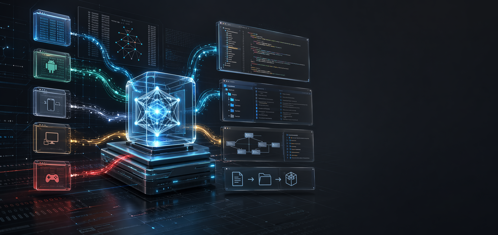

# RE-Pro




RE-Pro is a cross-platform reverse-engineering workbench built to turn opaque binaries and packaged apps into readable evidence, recovered source, and actionable rebuild workflows.

It combines format-aware extraction, source restoration, external tool orchestration, graph-based correlation, Codex/OpenAI-assisted approximation, rebuild planning, and patch/signing workflows in one system with a CLI, a PyQt5 desktop GUI, and an MCP server.

## Support RE-Pro

If RE-Pro helps your reverse-engineering or porting work, donations are appreciated:

Bitcoin: `bc1qzyzwkfgfkeu3v44edwxaw0pre2fdvl6nd8hv0w`

## Why RE-Pro

- Recover real source when it ships: source maps, managed resources, BAML/XAML, Tauri assets, manifests, symbols, package metadata, and bundled web payloads.
- Correlate everything: functions, strings, frameworks, artifacts, resources, findings, and external tool exports land in a unified analysis graph.
- Move beyond reporting: RE-Pro generates project templates, rebuild plans, signing plans, patch bundles, and bounded package actions instead of stopping at static dumps.
- Work from any interface: GUI for browsing/editing, CLI for repeatable automation, and MCP for LLM-driven evidence, reconstruction, and rebuild workflows.
- Use either OpenAI API keys or Codex ChatGPT OAuth credentials from `.codex/auth.json` for GPT-assisted reconstruction.

## Highlights

### Platform and Package Coverage

- Windows: PE, MSI, NSIS, Inno, CAB, .NET apphosts and bundles, PDB workflows, PE resources, native/game/UI heuristics.
- Android: APK, APKS, AAB, DEX, AAR, `resources.arsc`, JADX/apktool workflows, source-map recovery, signing and repack support.
- Apple: `.app`, `.ipa`, `.dmg`, `.pkg`, Mach-O inspection, entitlements, provisioning profiles, app extensions, framework heuristics.
- Linux and native ecosystems: ELF, AppImage, SquashFS, WASM, MIPS/PS2-style ELFs, Capstone previews, Ghidra/rizin/radare2 exports.
- Java and managed ecosystems: JAR, WAR, EAR, AAR, ILSpy, WPF/BAML/XAML recovery, ReadyToRun detection, managed resource extraction.
- Console and game formats: PSARC, PSP PBP/DATA.PSP/DATA.PSAR, PS3 PKG metadata, RARC, CRI/CPK, U8, NARC, AFS, HOG, WAD-family markers, GDeflate and DDL-oriented game payload hints.

### Recovery and Analysis

- JavaScript and web source-map restoration with shipped `sourcesContent`.
- Electron `app.asar` and unpacked resource recovery, including native ASAR fallback extraction.
- Tauri embedded asset extraction and frontend restoration.
- Best-effort frontend source reconstitution when source maps are absent, including hash-stripped asset names, Babel AST formatting, React compiler cache normalization, import/name propagation, JSX recovery, and optional LLM source-grade rewrites.
- Remote PDB acquisition from symbol servers.
- Unified `analysis_index.json` with normalized entities and relations.
- Structured ingestion and cross-correlation of Ghidra, rizin, radare2, JADX, and ILSpy-oriented exports.
- MSVC RTTI, vftable, class layout, constructor/destructor phase, thunk, call-edge, and pseudo-C++ source synthesis for symbol-poor native binaries.
- Live-process capture for already-running Windows software, including module metadata, readable memory dumps, mapped-image options, carved runtime payloads, and Frida-oriented traces.

### Reconstruction and Rebuild

- Architecture-porting workspaces with prepared source trees, x86/x64-to-arm64 style guidance, and heuristic or LLM-assisted portability notes.
- Recompile workspaces with Android Studio, Xcode, Node, Tauri/Electron, and CMake-oriented templates.
- Rebuild plans, signing plans, patch plans, run-to-run diffs, and diff-driven patch bundles.
- Bounded package actions for APK signing, Electron repack, Tauri packaging, and patch application.
- PSARC create/rebuild workflows preserving compression choices, block sizes, file order, and editable extracted overlays.
- Source-first browser workspaces for viewing and editing recovered files, manifests, archives, executables, JSON resources, PARAM.SFO, and hex/base64 nodes.
- Optional GPT-5.5/GPT-5.4-assisted approximation when direct source recovery is weak.

For a more scan-friendly matrix, see [docs/supported-formats.md](docs/supported-formats.md).

### Interfaces

- PyQt5 desktop GUI for reports, artifacts, recovered sources, and graph-driven pivots.
- Dedicated GUI surfaces for function evidence, recovery quality, background/stub jobs, live LLM status, and source-first file editing.
- CLI for analysis, live-process capture, source browsing/editing, architecture-port generation, profiles, comparison, patch-bundle creation, packaging actions, MCP launch details, and tooling install.
- MCP server exposing analysis, graph search, reconstruction, validation, diff, rebuild, and packaging workflows to external LLM clients.
- Saved JSON profiles for repeatable analysis and package-action runs.

## Fast Start

```bash
python -m pip install -e .
re-pro analyze path\to\target.exe -o analysis_output
```

For a fuller local setup:

```bash
re-pro install-tools
re-pro analyze path\to\target.exe -o analysis_output --external-tools
```

## Windows Releases

Windows release archives contain a compiled executable plus convenience wrappers:

- `re-pro.exe` for the CLI, package actions, MCP server, and GUI launcher.
- `re-pro-gui.cmd` to launch `re-pro.exe gui`.
- `re-pro-mcp.cmd` to launch `re-pro.exe mcp-server`.

To build the Windows release artifacts locally:

```powershell
C:\path\to\python311.exe -m venv .release-venv
.\.release-venv\Scripts\python.exe -m pip install -e . pyinstaller build
.\scripts\build_windows_release.ps1 -Python .\.release-venv\Scripts\python.exe
```

## CLI

Analyze a target:

```bash
re-pro analyze path\to\target.exe -o analysis_output
```

Run a high-yield pass with external tools, source beautification, Codex OAuth LLM support, and porting guidance:

```bash
re-pro analyze path\to\target.exe -o analysis_output --external-tools --beautify-frontend --llm --llm-auth codex-oauth --llm-model gpt-5.5 --llm-reasoning high --port-target-arch arm64 --port-mode hybrid
```

Compare two existing runs:

```bash
re-pro compare-runs path\to\base_run path\to\head_run -o diff_output
```

Create and apply a patch bundle from two runs:

```bash
re-pro create-patch-bundle path\to\base_run path\to\head_run -o patch_bundle
re-pro package-action --workspace-root path\to\run\porting\recompile --ecosystem patch --action apply-bundle --patch-bundle-path patch_bundle --target-root path\to\target_root
```

Run package rebuild or signing actions:

```bash
re-pro package-action --workspace-root path\to\run\porting\recompile --ecosystem electron --action repack
re-pro package-action --workspace-root path\to\run\porting\recompile --ecosystem tauri --action repack
re-pro package-action --workspace-root path\to\run\porting\recompile --ecosystem android-gradle --action sign-apk --artifact-path app.apk --keystore-path debug.keystore --key-alias androiddebugkey
```

Create or rebuild PSARC archives:

```bash
re-pro package-action --workspace-root path\to\workspace --ecosystem archive --action create-psarc --target-root path\to\assets --output-path out\assets.psarc --compression zlib --compression-level 9 --block-size 0x10000
re-pro package-action --workspace-root path\to\workspace --ecosystem archive --action overlay-rebuild --artifact-path base.psarc --target-root path\to\edited_extract --output-path out\patched.psarc
```

PSP PBP/DATA.PSP/DATA.PSAR handling is available through analysis and the file browser:

```bash
re-pro analyze path\to\EBOOT.PBP -o analysis_output --external-tools
re-pro browse build path\to\analysis_run --rebuild
re-pro browse write path\to\analysis_run node_00042 --mode json --content-file edited_PARAM.SFO.json
re-pro browse patch path\to\analysis_run node_00043 --offset 0x20 --hex "00 00 00 00"
```

`pspdecrypt` is used for DATA.PSP decryption and DATA.PSAR extraction. `psp-packer` is used for DATA.PSP PRX packing when edited decrypted payloads are saved. DATA.PSAR repack/encrypt is exposed through `RE_PRO_PSP_PSAR_PACK_CMD` because no bundled general PSAR repacker is available.

Load additional local analyzer plugins:

```bash
re-pro analyze path\to\target.exe -o analysis_output --plugin-dir path\to\plugins
```

Attach to a live process or capture by process name:

```bash
re-pro live-process list --query pcsx2
re-pro live-process capture --process-name pcsx2-qt.exe -o analysis_output\pcsx2_live --include-images
re-pro analyze --live-attach --live-process-name pcsx2-qt.exe -o analysis_output
```

Build and edit a source-first browser workspace for an existing run:

```bash
re-pro browse build path\to\analysis_run --rebuild
re-pro browse read path\to\analysis_run node_00042 --mode json
re-pro browse write path\to\analysis_run node_00042 --mode text --content-file edited_file.cpp
re-pro browse patch path\to\analysis_run node_00043 --offset 0x120 --hex "90 90"
```

Generate an architecture-porting workspace from an existing run:

```bash
re-pro architecture-port path\to\analysis_run --source-arch x86_64 --target-arch arm64 --mode hybrid
```

Save, load, and inspect repeatable profiles:

```bash
re-pro analyze path\to\target.exe -o analysis_output --save-profile "Deep native pass"
re-pro profiles list --query native
re-pro analyze --profile "Deep native pass"
```

## Tooling

Install local reverse-engineering dependencies:

```bash
re-pro install-tools
```

That tooling surface includes support for Ghidra, rizin, radare2, JADX, apktool, ILSpy, .NET workflows, Frida-oriented runtime tracing, and helper runtimes used by RE-Pro's analysis and rebuild paths.

For richer runtime instrumentation:

```bash
python -m pip install frida frida-tools
re-pro analyze path\to\target.exe -o analysis_output --runtime-trace
```

For optional NVIDIA GDeflate recovery in game pipelines:

```bash
python -m pip install nvidia-nvcomp-cu12
```

For remote symbol acquisition, RE-Pro uses Microsoft's public symbol server by default. To override or extend the server list:

```bash
set RE_PRO_SYMBOL_SERVERS=https://msdl.microsoft.com/download/symbols/;https://your-symbol-server.example/symbols/
```

## GPT and Codex Reconstruction

RE-Pro can call OpenAI models through a normal API key or through the Codex ChatGPT OAuth token cache written by Codex CLI/Desktop. The default `--llm-auth auto` mode uses `OPENAI_API_KEY` first, then falls back to `CODEX_AUTH_JSON`, `CODEX_HOME\auth.json`, or `~\.codex\auth.json`.

API-key mode uses the OpenAI Responses API directly. Codex OAuth mode shells out to `codex exec` so the Codex CLI handles ChatGPT token refresh and backend access; install and sign in with Codex first (`npm install -g @openai/codex`, then `codex login`) before using `--llm-auth codex-oauth`.

Run GPT-assisted reconstruction with an API key:

```bash
set OPENAI_API_KEY=...
re-pro analyze path\to\target.exe -o analysis_output --llm --llm-model gpt-5.5 --llm-reasoning high --llm-background --llm-task "Focus on updater and IPC logic"
```

For interactive runs where you want the model's markdown summary mirrored into the terminal log immediately:

```bash
re-pro analyze path\to\target.exe -o analysis_output --llm --llm-foreground --llm-model gpt-5.5
```

Run through Codex OAuth instead of an API key:

```bash
re-pro analyze path\to\target.exe -o analysis_output --llm --llm-auth codex-oauth --llm-model gpt-5.5 --llm-reasoning xhigh
```

Use a custom Codex auth cache:

```bash
re-pro analyze path\to\target.exe -o analysis_output --llm --llm-auth codex-oauth --codex-auth-json C:\Users\you\.codex\auth.json
```

Auto-trigger GPT only when recovery is weak:

```bash
re-pro analyze path\to\target.exe -o analysis_output --llm-auto --llm-background
```

Set model, reasoning, verbosity, and output limits explicitly:

```bash
re-pro analyze path\to\target.exe -o analysis_output --llm --llm-model gpt-5.5 --llm-reasoning medium --llm-verbosity medium --llm-max-output 128000
```

Disable autonomous dependency installation or build checks:

```bash
re-pro analyze path\to\target.exe -o analysis_output --llm --llm-no-install --llm-no-build-checks
```

Supported reasoning values are `none`, `low`, `medium`, `high`, and `xhigh` for current GPT-5.5/GPT-5.4-class models. The GUI exposes the same model, auth, reasoning, verbosity, output-token, background-job, dependency-install, and build-check controls.

## MCP

Run RE-Pro as an MCP server over standard I/O:

```bash
re-pro mcp-server --transport stdio
```

Or via the dedicated entry point:

```bash
re-pro-mcp --transport stdio
```

For HTTP-capable MCP clients:

```bash
re-pro mcp-server --transport streamable-http --host 127.0.0.1 --port 8000
```

To print exact MCP client JSON, or start the MCP server in the background and write the client config:

```bash
re-pro mcp-info --transport streamable-http --host 127.0.0.1 --port 8000 --start
```

The MCP surface exposes:

- Analysis execution through `analyze_target`.
- Run discovery and inspection through `list_analysis_runs`, `read_report`, `read_analysis_index`, `search_analysis_index`, and `get_index_entity`.
- Artifact and recovered-source browsing through `list_artifacts`, `list_recovered_sources`, and `read_output_file`.
- Rebuild workspace preparation and validation through `prepare_recompile_workspace`, `inspect_toolchains`, `install_project_dependency`, `run_project_command`, `write_reconstruction_file`, and `validate_reconstruction_file`.
- Run-to-run comparison through `compare_analysis_runs`.
- Patch-bundle creation through `create_patch_bundle_from_runs`.
- Package rebuild, signing, and patch execution through `run_packaging_action`.
- Client-side sampling workflows through `approximate_source_with_sampling`.

This makes MCP a genuine alternative to direct API integration: an external LLM can inspect the graph, browse evidence, write grounded approximations, validate them locally, and drive rebuild steps through RE-Pro's own execution surface.

## GUI

Launch the desktop GUI with:

```bash
re-pro-gui
```

Or on this repo's Windows setup:

```bash
launch_gui.bat
```

The GUI includes controls for Ghidra and external-tool jobs, frontend beautification, Codex/API-key LLM settings, architecture porting, runtime tracing, live-process attachment, profile save/load, MCP server startup with exact JSON, package actions, workspace browsing, and report/artifact/source inspection.

## Output

Each analysis run writes a timestamped folder containing:

- `report.json`
- `report.md`
- `analysis_index.json`
- `analysis_pipeline.json`
- recovered sources and extracted artifacts
- porting guidance and prepared source bundles
- recompile templates and manifests
- recovery quality, evidence graph, and stub-elimination manifests
- optional diff, patch, and packaging outputs
- optional `llm_assist`, `mcp_reconstruction`, `runtime_trace`, `live_process`, `browser_workspace`, and frontend source-lift outputs

## Plugins

RE-Pro auto-loads local analyzer plugins from [plugins/README.md](plugins/README.md) when the `plugins/` directory exists. Additional plugin directories can be passed with `--plugin-dir`, and packaged plugins can register entry points under `re_pro.analyzers`.

## Important Limits

There is no universal, lossless decompiler for arbitrary native binaries.

For C, C++, Rust, Go, and other stripped native targets, RE-Pro can classify, extract symbols, recover adjacent artifacts, drive specialist tooling, and help reconstruct plausible project structure, but it cannot guarantee restoration of the original source tree unless the binary or package actually ships that information.

Electron and web-style apps remain some of the highest-yield targets for file-name and source restoration because they often ship:

- `app.asar` or unpacked JS bundles
- `package.json`
- source maps with `sources` and `sourcesContent`
- original relative file paths embedded in build metadata

Installer-wrapped apps should usually be unpacked first. RE-Pro detects common Windows and Apple packaging wrappers and can extract nested payloads like `.exe`, `.dll`, `.app`, `app.asar`, and source maps before deeper analysis.
